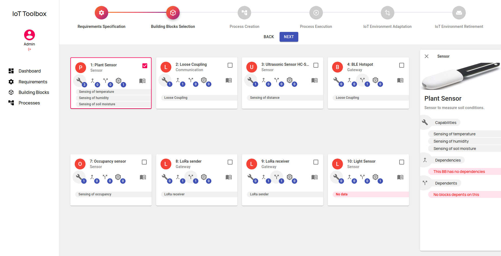

# IoT Toolbox - Easing the Setup of IoT Applications

This project contains the **IoT Toolbox** Prototype, an IoT platform developed for easing the setup of IoT environments and their applications.


This specific project deals with the Front-end side of the project. The back-end documentation is provided as the GitHub project [IoT Toolbox Back-End](https://github.com/mtfrigo/IoT-Toolbox-Backend).

# Presentation 



The toolbox contains common building blocks that are oftentimes used in the creation of IoT environments. These building blocks can represent hardware components, network protocols, message brokers, gateways, IoT platforms, or any other software component. A building block consists of a high-level description to be understandable by domain experts as well as concrete implementations. The building blocks are provided by experts in building IoT environments and are included in a toolbox, which can be accessed by domain experts.

Furthermore, we introduce a business process based approach to set up the IoT environments based on the suggested building blocks. Hence, it makes sense to use business process management for orchestration of these steps. In this paper, we use the Business Process.


How to install and use the Toolbox is explained in the following.

## Installation (for developers)

The following software components are used in order to set up the toolbox: 
* Back-End: [NodeJS 12.18.0](https://nodejs.org/en/), [Docker](https://docs.docker.com/get-docker/) and NPM 6.14.4.
* Front-End: ReactJS.

### 1.1 Installation

### 1.2 Dependencies
```
npm install
```


## Running the application
```
npm start
```

To setup the backend go to installation section on the [IoT Toolbox BackEnd](https://github.com/mtfrigo/IoT-Toolbox-Backend) project.
